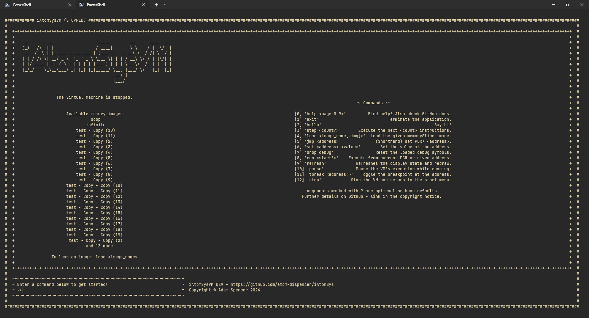
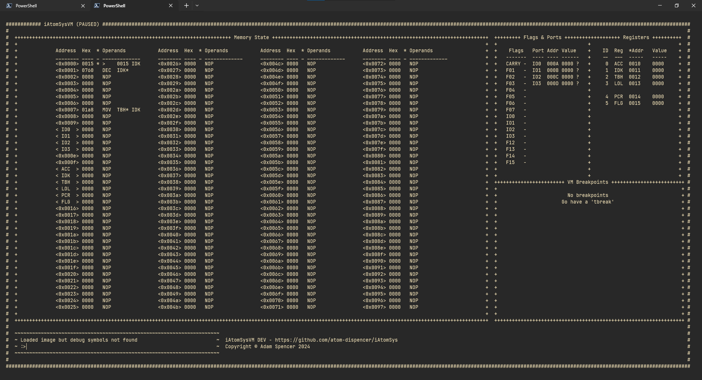
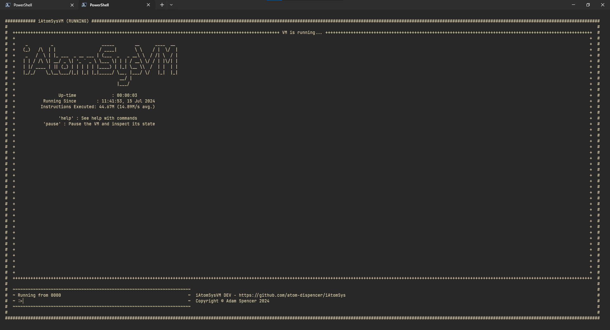

# iAtomSys Virtual Machine


[](https://github.com/atom-dispencer/iAtomSys/actions/workflows/github-code-scanning/codeql)

[](https://github.com/atom-dispencer/iAtomSys/actions/workflows/vm_ci.yml)

| Language | Tools         | Dependencies                       |
|----------|---------------|------------------------------------|
| Java 17  | IntelliJ IDEA | Spring Framework v3.2 (Web, Shell) |
|          | Gradle 8.6    | Lombok                             |

A 16-bit virtual computer at the core of the iAtomSys ecosystem.

## Known issues

- Windows CMD and PowerShell native hosts:
  - See [note to self](https://learn.microsoft.com/en-gb/windows/console/console-virtual-terminal-sequences)
  - Users must press <enter> twice to run commands 
  - Application does not return to the previous buffer correctly on exiting
- Debug symbol parsing/loading is experimental

# Building & Running

The iAtomSysVM uses Java with the Gradle build system and includes a Gradle wrapper.


To build an executable JAR file:

```sh
# Optionally, you can clear the build directory first
./gradlew clean

# Build the JAR using Gradle.
# Please replace $VERSION with the current version of the VM.
# In GitHub Actions, $VERSION is defined by the Action configuration, but for development purposes this
#   can be left as 'DEV' or similar (see debug.ps1).
./gradlew build -Pversion="$VERSION"

# To run the suite of unit tests, add the Gradle 'test' task:
./gradlew build test -Pversion="$VERSION"
```

The iAtomSysVM is a terminal-app and to run its JAR file, you will need a Java JRE installed.
The application was developed on Java 17 and support for other versions is not guaranteed.
You can run the JAR as normal:

```sh
# To launch normally, after building, with a terminal in the /VM/ directory:
java -jar ".\build\libs\vm-DEV.jar"
# You may need to change the path if your $VERSION build property is not 'DEV' (see above)

# Or to launch with a debug server for development:
java -agentlib:jdwp=transport=dt_socket,server=y,suspend=n,address=*:5005 -jar ".\build\libs\vm-DEV.jar"
```

Notes:
- Your terminal must be compatible with ANSI escape codes for the VM's UI to function.
  - The 
- The VM application consists of a Spring HTTP with REST API and a Spring Shell terminal-based UI.
- The VM does not require any external connections, but must be allowed to launch a Spring HTTP server on port 8080.
  - The Spring server binds to `127.0.0.1` (`server.address=127.0.0.1`) to prevent external connections.
  - It is not currently easy to change the port that the VM runs on, but this feature is on the way.

The `debug.ps1` script is a utility PowerShell script for developers which performs the `clean`, `build` and 
    `test` tasks, then launches the JAR with a JVM debugger.
This is primarily for my own use, but should be trivial to port to other operating systems/shells.

# Manual

## Objectives & Requirements
To limit the scope of the project, I created the following requirements:

- The VM shall operate on a 16-bit architecture.
- No single action by the virtual CPU shall require the reading of more than 1 integer.
- The VM shall store numbers big-endian'ly.

## Why Java?
Java was my first programming language and still holds a special place in my heart.
If you [_dig back many years_](https://github.com/atom-dispencer/MagiksMostEvile), you'll find my ancient 
    adventures in modding Minecraft, but I warn you, it's not pretty.
My intention for iAtomSys is to use a different language for each tool/stage, so by using a language I'm
    familiar with, I can freely focus on the aesthetics of the 'front-end' of the project.

## Operation

### User Inteface

The VM has a display for each of its three states: `STOPPED`, `PAUSED` and `RUNNING`.
The user can interact with the VM by typing *commands* into the command-input in the bottom-left corner
    of the UI.

#### Commands

Commands are described briefly on the `STOPPED` page and by using the `help` command.
Addresses and values are hexadecimal 16-bit integers unless otherwise specified.

| Command | Examples | Description |
| --------------- | --------------- | --------------- |
| `help <page>` | `help 3` | Displays the given line from the help messages. |
| `exit` | `exit` | Exits the VM and closes the application gracefully, returning the terminal to its pre-application state. |
| `hello` | `hello` | Says hello :) |
| `step <count?>` | `step` / `step 50` | Execute the given number of instructions, starting at the current program-counter, defaulting to 1 instruction. |
| `load <image_name[.img]>` | `load test` / `load test.img`| Copy the given binary file from the `./images/` directory into the VM's memory and load the matching `xxx.img.json` debug symbols, if present. |
| `jmp <address>` | `jmp ab01` | Set the value of the program counter to the given value. Shorthand for `set PCR* <address>`. |
| `set <address> <value>` | `set PCR 0abc` / `set 23ca IDK*` | Set the value at the given memory address to the given value. Register names are parsed as they are in iAtomSys Assembly (iASM): `XXX` refers to the address *pointed to* by the *value*, whereas `XXX*` refers to the address of the *register itself*. |
| `drop_debug` | `drop_debug` | Forget the current set of debug symbols, if any are loaded. |
| `run <address?>` | `run` / `run 52dc` | Set the value of the program counter to the given address, defaulting to the current value of the program counter, and switch to the its `RUNNING` state. |
| `refresh` | `refresh` | Immediately redraw the UI without updating any of its state. |
| `pause` | `pause` | Switch the VM to its `PAUSED` state. |
| `tbreak <where>` | `tbreak` / `tbreak 8a6b` / `tbreak prev` | In the `PAUSED` state, toggle the breakpoint at the given location on/off, or removes all breakpoints with `tbreak nuke`. To toggle a breakpoint, the argument can be a hex address to toggle at that address, `here` to use the current value of the program counter, `prev` to take the address before that of the program counter's value, or `next` to take the address after. The calculated addresses in `prev` and `next` wrap from `0000-ffff` and vice-versa. Registers are not accepted. If the VM is not `PAUSED`, this command does nothing. |
| `stop` | `stop` | Switch the VM to its `STOPPED` state. |

#### STOPPED state


#### PAUSED state


#### RUNNING state


## Instruction Set
### 'Addressing' the requirements ;)
Some instruction-gymnastics were required to satisfy the requirement that no instruction shall be wider
    than one integer.

This restriction prevents instructions like `LDA 09af` because by definition the 16-bit address `09af`
    is 16-bits wide.
To get around this restriction, even integers are interpreted at instructions, while odd integers are
    interpreted implicitly as a load instruction.
This has the side-effect that you cannot load an even number into a register, and you must instead load an
    even number and in/decrement it.

### Instruction Format
The virtual CPU will interpret one 16-bit integer at a time:
```
  Instruction
  .... .... .... ... 0
  ^-------^ ^------^ ^ IA flag (set to Instruction-mode)
  ^         ^ Flags (numbered 0-6)
  ^ Opcode
        
  Address (15-bit value)
  .... .... .... ... 1
  ^----------------^ ^ IA flag (set to Address-mode)
  ^ Address
```
If the integer is odd (contains a 1 in its least significant bit), it will be copied into the least-
  significant 15 bits of the IDK register and left-shifted once.
If the integer is even, it will be interpreted as one of the instructions denoted below.

Many `Register` flags are followed by a `Register*` flag. If the `Register*` flag is enabled, the
  true 16-bit memory address of the register should be used, rather than the register's contents.

| Instruction            | Assembly | Opcode | Flags                                                                | Function                                                                |
|------------------------|----------|--------|----------------------------------------------------------------------|-------------------------------------------------------------------------|
| No Operation           | NOP      | 00     |                                                                      | Does nothing (effectively a 1-cycle pause).                             | 
| Move                   | MOV      |        | `0-1: Register1`, `2: Register1*`, `3-4: Register2`, `5: Register2*` | Move the value at `Address1` into `Address2`.                           |
| Set CPU Flag           | FLG      |        | `0-3: 4-bit ID`, `4: On/Off`                                         | Set the given bit (0-15) in the FLG hidden-register to the given value. |
| Push to Stack          | PSH      |        | `0-1: Register`, `2: Register*`                                      | Push the value at the given address onto the top of the CPU stack.      |
| Pop from Stack         | POP      |        | `0-1: Register`, `2: Register*`                                      | Pop the value off the top of the stack into the given address.          |
| Increment              | INC      |        | `0-1: Register`, `2: Register*`                                      | Increment the integer stored at the given address by 1.                 |
| Decrement              | DEC      |        | `0-1: Register`, `2: Register*`                                      | Decrement the integer stored at the given address by 1.                 |
| Add                    | ADD      |        | `0-1: Register`, `2: Register*`                                      | Add the value at the given address to `ACC`.                            |
| Subtract               | SUB      |        | `0-1: Register`, `2: Register*`                                      | Subtract the value at the given address from `ACC`.                     |
| Zero                   | ZRO      |        | `0-1: Register`, `2: Register*`                                      | Set the value at the given address to 0.                                |
| IO-Port Input-Shuffle  | PIS      |        | `0-1: 2-bit ID`                                                      | Force the given `IOPort` to read immediately.                           |
| IO-Port Output-Shuffle | POS      |        | `0-1: 2-bit ID`                                                      | Force the given `IOPort` to write immediately.                          |

## Registers

Registers in the VM are stored in memory and can therefore be accessed through standard memory
  addresses - i.e. a 'Register' is an abstraction for a known constant memory address. 
Accessing registers directly via their addresses is, however, inadvisable and generally impractical.
Registers can be passed as flags to instructions via their 2-bit ID.

Registers' addresses in memory are offset by their ID from the address *0x0010*,
  so TBH would be at `0x0010 + 0x0002 = 0x0012`.

| Register          | Assembly | ID | Function                                           |
|-------------------|----------|----|----------------------------------------------------|
| Accumulator       | ACC      | 00 | The VM/CPU accumulator for mathematical operations | 
| I Don't Know...   | IDK      | 01 | No internal VM/CPU function. User-controlled       |
| To Be Honest...   | TBH      | 02 | No internal VM/CPU function. User-controlled       |
| Laugh Out Loud... | LOL      | 03 | No internal VM/CPU function. User-controlled       |

### Hidden Registers
Several registers are hidden, meaning that they cannot be addressed directly from instructions.
Interactions with these must happen indirectly via other instructions.

| Register        | Hex | Function                                         |
|-----------------|-----|--------------------------------------------------|
| Program Counter | 04  | Stores the current address for program execution | 
| Flags           | 05  | Stores CPU flags.                                | 

## Flags
CPU flags are stored in the hidden register FLG.

| Flag  | Bit | Mask   |                                                                |
|-------|-----|--------|----------------------------------------------------------------|
| Carry | 1   | 0x0001 | Active when the accumulator has carried a bit during addition. |


## IO-Ports (External Communication)
The VM can communicate via its four `IOPorts`, which behave somewhat like UARTs.
Each `IOPort` is bound to a memory address and a CPU flag, and will passively receive and buffer
  input from external sources, and will not change the VM state until commanded to perform an input-
  or output-shuffle operation.
*(See the `PIS` and `POS` instructions)*

At the end of every CPU cycle, each `IOPort` will set its bound CPU flag **HIGH** if its input 
  buffer has outstanding data, otherwise it will set it **LOW**.

### Operations
- Read:
  - Copy the next value from internal input buffer to the bound address.
  - If there is no data in the input buffer, the copied value will be zero.
- Write:
  - Copy the value at the bound address into its internal output buffer.

## Example Programs
```
// Double the value in the accumulator

// Registers
ACC: 01
IDK: 00

// Program
RCP ACC IDK
ADD IDK
```
```
// Add two numbers from known memory addresses

// Memory (hex)
0xff00: 01 f4  // 500
0xff01: 00 fa  // 250
0xff02: 00 00  // 0

// Program
ff01          // Read ff01 into IDK (want ff00 but must be odd)
DEC IDK       // Decrement IDK ff01 -> ff00
MRD IDK LOL   // ^
RCP MEM ACC   // Move 500 into ACC

ff01          // Move ff01 into IDK (it's odd, so no changes!)
RCP IDK       // Read "250" from ff01 into MEM
MRD IDK       // ^

ADD MEM       // Add the value in MEM to that in ACC, storing the result in ACC
RCP ACC MEM   // Write ACC (750) back to memory
ff03          // Want to write to ff02, but that's even!
DEC IDK       // ^
RCP IDK PTR   // Write to ff02
MWT           // ^
```
```
// Read a value from an unknown memory address

// Memory
ff00: ff 02  // The address ff02
ff01: 00 64  // The number 100

ff01         // Load ff02 into IDK
INC IDK      // ^
RCP IDK PTR  // Copy IDK to PTR
MRD          // Read value ("100") at value in PTR (ff02) into MEM
// MEM now contains 0064
```
